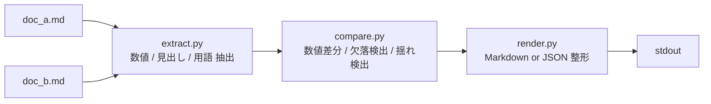

# qai-checker-mini

2つの文書（Markdown / テキスト）を比較し、**数値の食い違い・工程の抜け・用語の表記揺れ**を一覧出力する軽量 CLI ツール。

## なぜ作ったか

提案書・仕様書・計画書の改訂時、複数バージョン間の齟齬チェックは人手に頼りがちです。
「サーバ台数が 12 → 15 に変わったのに予算が据え置き」「見出しが片方だけ消えている」「Terraform vs Tarraform のタイポ」──こうした見落としをルールベースで機械的に検出するミニツールです。

## 使い方

### インストール

```bash
git clone https://github.com/Kensuke-sam/qai-checker-mini.git
cd qai-checker-mini
make install   # venv作成 & 依存インストールを自動で行います
```

### 実行

```bash
# Markdown 出力（デフォルト）
python3 -m qai_checker_mini examples/doc_a.md examples/doc_b.md

# JSON 出力
python3 -m qai_checker_mini examples/doc_a.md examples/doc_b.md --format json

# 用語揺れの閾値・件数を調整
python3 -m qai_checker_mini examples/doc_a.md examples/doc_b.md --min-sim 0.80 --topk 50
```

`make run` でもサンプル文書を使って実行できます。

### テスト

```bash
make test
```

## 出力例

`examples/doc_a.md` と `examples/doc_b.md` を比較した結果:

### numbers

| issue | a | b | location |
|---|---|---|---|
| - ダウンタイムは最大___間とする | 4時 | 8時 | A:L14 / B:L14 |
| - データ移行量は約___ | 2.5TB | 3.0TB | A:L13 / B:L13 |
| - 現行システムの稼働率は___を維持する | 99.9% | 99.95% | A:L12 / B:L12 |
| 対象サーバ台数: ___ | 12台 | 15台 | A:L6 / B:L6 |
| 総予算: ___ | 15,000,000円 | 18,000,000円 | A:L8 / B:L8 |

### missing

**headings_only_in_a:** システム移行計画書
**headings_only_in_b:** Phase 4: 運用安定化（10月）、システム移行計画
**steps_only_in_a:** AWSアカウントのセットアップ、DNSの切り替え ほか
**steps_only_in_b:** 負荷テスト実施、運用手順書の整備、障害対応訓練 ほか

### terminology

| term_a | term_b | similarity |
|---|---|---|
| PostgreSQL | Postgres | 0.889 |
| Terraform | Tarraform | 0.889 |

全出力は [`examples/expected_sample.md`](examples/expected_sample.md) を参照。

## 設計



| モジュール | 役割 |
|-----------|------|
| `cli.py` | argparse によるコマンドライン引数処理 |
| `extract.py` | 正規表現で数値・見出し・箇条書き・用語を抽出 |
| `compare.py` | コンテキスト付き数値比較、集合差分、SequenceMatcher による類似度計算 |
| `render.py` | Markdown テーブル / JSON への整形出力 |

## 今後の改善

現在はルールベース（正規表現 + 文字列類似度）で検出しているため、ラベルと数値の意味的対応や同義語の判定には限界があります。将来的には:

- **LLM によるラベル対応**: 「対象サーバ台数」と「移行対象ホスト数」が同じ意味であることを判定
- **同義語辞書 / Embedding**: 用語揺れ検出を SequenceMatcher からセマンティック類似度へ拡張
- **RAG パイプライン**: 社内用語辞書を検索し、正式名称との照合を自動化

といった方向で精度を向上させられます。

## 制限事項

- 数値比較は「同じ行テキスト構造を持つ行」同士のマッチングに依存するため、文書構造が大きく異なると検出漏れが起きます。
- 用語揺れは `difflib.SequenceMatcher` による表層的な文字列一致のみです。意味的に同じだが表記がまったく異なる語（例: "EC2" と "仮想マシン"）は検出できません。
- Markdown 以外のフォーマット（Word, PDF 等）には未対応です。

## ライセンス

MIT
